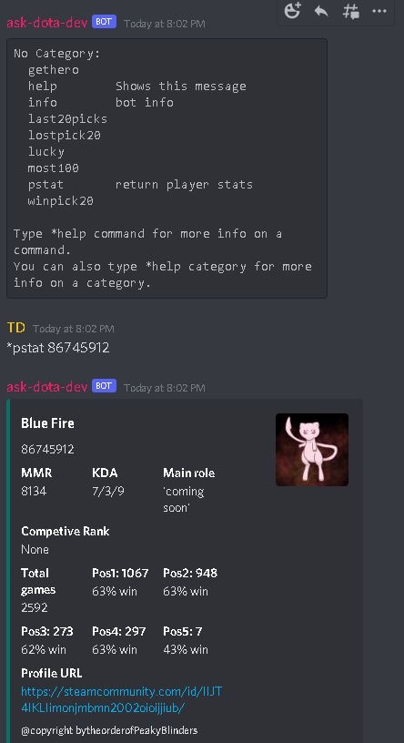

[![Contributors][contributors-shield]][contributors-url]
[![Forks][forks-shield]][forks-url]
[![Stargazers][stars-shield]][stars-url]
[![Issues][issues-shield]][issues-url]


<!-- PROJECT LOGO -->
<br />
<p align="center">
  <a href="https://github.com/nhatvo1502/ask-dota">
    
  </a>

  <h3 align="center">Ask Dota Discord Bot</h3>

</p>


<!-- TABLE OF CONTENTS -->
<details open="open">
  <summary>Table of Contents</summary>
  <ol>
    <li>
      <a href="#about-the-project">About The Project</a>
      <ul>
        <li><a href="#built-with">Built With</a></li>
      </ul>
    </li>
    <li>
      <a href="#getting-started">Getting Started</a>
      <ul>
        <li><a href="#prerequisites">Prerequisites</a></li>
        <li><a href="#installation">Installation</a></li>
      </ul>
    </li>
    <li><a href="#usage">Usage</a></li>
    <li><a href="#contributing">Contributing</a></li>
    <li><a href="#license">License</a></li>
    <li><a href="#contact">Contact</a></li>
    <li><a href="#acknowledgements">Acknowledgements</a></li>
  </ol>
</details>


<!-- ABOUT THE PROJECT -->
## About The Project



Dicord bot utilising data from OpenDotaApi

### Built With

* [Python](https://www.python.org) ver >3.8
* [OpenDotaAPI](https://www.opendota.com/)
* [Discord](https://discord.com)


<!-- GETTING STARTED -->
## Getting Started

### Installation

1. Clone the bot by running the below command on your terminal:


```
git clone https://github.com/nhatvo1502/ask-dota
```

2. Sign up a discord account if you don't already have one [here](https://discord.com)

3. A discord app will need to be set up following this [instruction](https://viebly.com/create-basic-discord-bot/technology/)

4. Once the bot is create and added to a server, copy the bot token and create a .env file in ask-dota folder with the details below:

```
DISCORD_TOKEN=<your-bot-token>
PREFIX=*
```

5. Install all required modules:

```
python install -r requirements.txt
```

6. Once all the installation steps are done, run the bot.py file:

```
python bot.py
```
<!-- USAGE EXAMPLES -->
## Usage

Run *help for list of all available commands


<!-- MARKDOWN LINKS & IMAGES -->
<!-- https://www.markdownguide.org/basic-syntax/#reference-style-links -->
[contributors-shield]: https://img.shields.io/github/contributors/nhatvo1502/ask-dota.svg?style=for-the-badge
[contributors-url]: https://github.com/nhatvo1502/ask-dota/graphs/contributors
[forks-shield]: https://img.shields.io/github/forks/nhatvo1502/ask-dota.svg?style=for-the-badge
[forks-url]: https://github.com/nhatvo1502/ask-dota/network/members
[stars-shield]: https://img.shields.io/github/stars/nhatvo1502/ask-dota.svg?style=for-the-badge
[stars-url]: https://github.com/nhatvo1502/ask-dota/stargazers
[issues-shield]: https://img.shields.io/github/issues/nhatvo1502/ask-dota.svg?style=for-the-badge
[issues-url]: https://github.com/nhatvo1502/ask-dota/issues